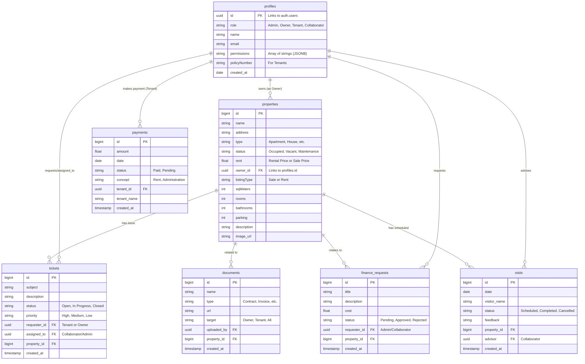

# SIKAI CX Platform - Entity-Relationship Diagram (ERD)

## 1. Information Sources
This diagram is inferred from:
- **Supabase Migrations**: Defining SQL tables, constraints, and policies.
- **Frontend Types**: `types.ts` defining the data models used in the application.
- **Seed Data**: `seed.sql` showing initial data relationships.

## 2. Mermaid.js ER Diagram

## 3. Data Integrity & Relationships

### Core Relationships
*   **Profiles (Users)**: The central entity. `id` is a UUID matching `auth.users`.
    *   **Roles**: Defined by the `role` column ('Admin', 'Owner', 'Tenant', 'Collaborator').
    *   **Cardinality**: A Profile can own multiple Properties (1:N), request multiple Tickets (1:N), and make multiple Payments (1:N).

### Property Management
*   **Properties**: Linked to a single Owner (`owner_id`).
    *   **Orphaned Data Risk**: If a Profile is deleted, `msg_20260116183000` ensures `owner_id` becomes NULL (Set Null), preserving the Property record.

### Maintenance & Support (Tickets)
*   **Tickets**: Link a `Requester` (Tenant/Owner) to an `Assignee` (Collaborator).
    *   **Property Link**: Essential for knowing where the issue is.
    *   **Update**: `requester_id` and `assigned_to` also Set Null on user deletion to preserve history.

### Finance
*   **Finance Requests**: Linked to a property via `property_id` (Added in recent migration). Used for Owners to approve repairs.
*   **Payments**: Linked to Tenants. Critical for tracking income.

### Documents
*   **Documents**: Can be generic (visible to role groups) or specific (though schema integration varies). Often linked to Properties or general uploads.
